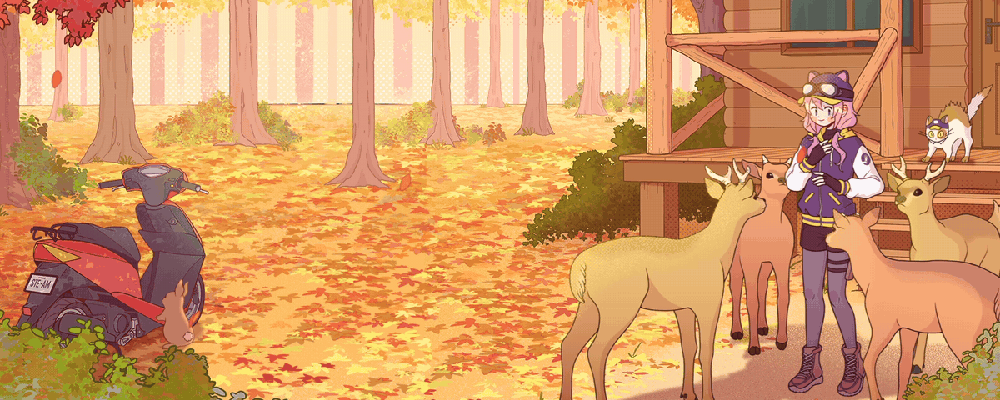
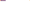
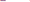
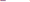
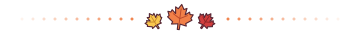

<h3 align="center">Backend Developer</h3>

  <a href="mailto:kanjoon1@hanyang.ac.kr">kanjoon1@hanyang.ac.kr</a>

<h3><picture></picture></h3>

- <code>2026.3 ~ <b>Present</b>&nbsp;</code>&nbsp; 한양대학교 에리카 조기취업형 계약학과 · 재학
- <code>2022.3 ~ 2024.2&nbsp;&nbsp;</code>&nbsp; 건국대학교 글로컬 캠퍼스 컴퓨터 공학과 · 자퇴

<h3><picture></picture></h3>

- <code>2025.3 ~ <b>Present</b>&nbsp;</code>&nbsp; <a href="http://www.drvalue.co.kr/">(주) 디알밸류</a> · BE Developer
- <code>2023.07 ~ 2025.02</code>&nbsp; (주) 싱귤래리티 창업 · BE Developer
  - Chatnote (대학생을 위한 AI 공부 필기앱) · BE Developer

<h3><picture></picture></h3>

- <code>Language&nbsp;</code>&nbsp; 
- <code>Framework</code>&nbsp;   
- <code>Tool&nbsp;&nbsp;&nbsp;&nbsp;&nbsp;</code>&nbsp;    

  <picture></picture>

<picture>
  <source media="(prefers-color-scheme: dark)" srcset="https://raw.githubusercontent.com/leenuu/leenuu/main/assets/snake-dark.svg">
  <source media="(prefers-color-scheme: light)" srcset="https://raw.githubusercontent.com/leenuu/leenuu/main/assets/snake.svg">
  
</picture>

